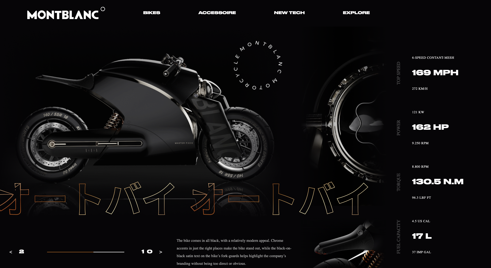

*Intégration maquette html css*
## Contenu du projet
### Description des fichiers présents dans le projet :

- **index.html** :
  - La page d'accueil du site.

- **style.css** :
  - Les styles CSS pour la mise en forme du site.
  - ./assets/ Dossier contenant les images utilisées sur le site.
  - ./font/ Dossier contenant les polices

### Comment utiliser ce projet

- Cloner ce dépôt de code: git clone https://github.com/Gwenael-Cotton/Bike.git

- Ouvrir le fichier index.html dans votre navigateur.